# MOTION//RUSH

**Браузерная неоновая игра, которой управляют телом через обычную веб-камеру. Беги. Прыгай. Танцуй.**

Admit Hackathon 2026 · кейс «Motion — камера вместо джойстика» · направление **A / GAME**

🔗 **Демо: [motion-rush.vercel.app](https://motion-rush.vercel.app)** · работает в Chrome / Edge / Safari / Firefox, на ноутбуке и телефоне, ничего устанавливать не нужно.

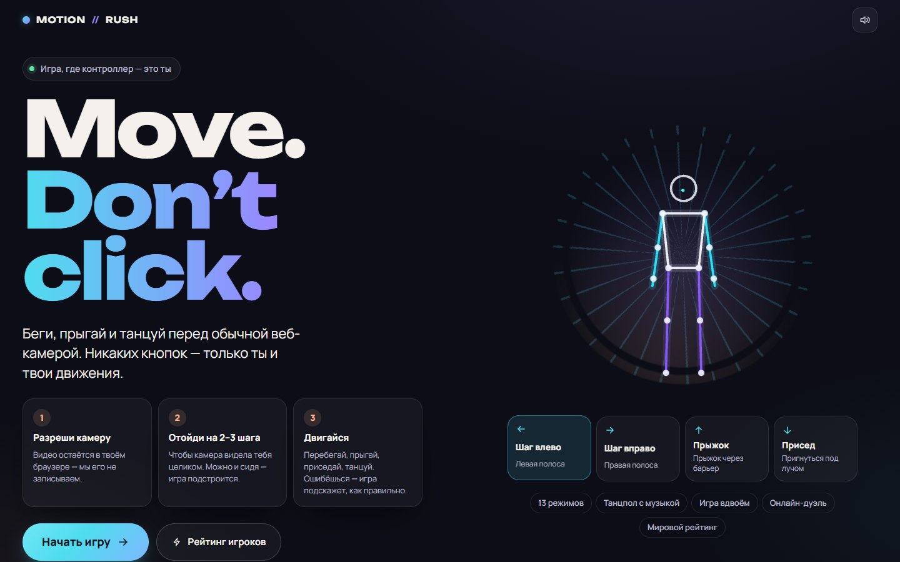

## Что нового после первого этапа (1–3 октября)

- **4 новые мини-игры — всего 17 режимов.** Star Catch: лови руками звёзды, которые вспыхивают вокруг тебя. Freeze!: «Море волнуется» — на красный замри в загаданной фигуре, камера говорит, какая часть тела шевельнулась. Reaction: реакция в миллисекундах. Squat 30: приседания на время с подсказками о технике.
- **«Рентген»** (кнопка в игре или клавиша X) — живая панель «как игра видит тебя»: скорость распознавания, измеренные значения против порогов, состояние жестов и сработавшее правило режима «ошибка».
- **Игра вдвоём переделана:**
  - у каждого игрока свой трекер;
  - камера переключается на широкий кадр 16:9;
  - полосу меняет наклон или маленький шаг;
  - перед стартом подсвечены зоны «встань сюда»;
  - окна по времени шире, с поправкой на то, что распознавание двоих медленнее.
- **Распознавание надёжнее:**
  - скелет больше не «съезжает» с человека: трекер сбрасывается при смене кадра, пороги уверенности строже;
  - на медленном ноутбуке (например, рядом с видеозвонком) включается щадящий режим — лёгкое сглаживание и более широкие окна, поэтому короткий прыжок не теряется.
- **Новые суперсилы в забеге.** Кроме щита и буста ×2 — **магнит** (энергия со всех полос летит к тебе 8 секунд), **замедление** (время течёт на 40% медленнее, препятствия подлетают не спеша) и **сердце** (+1 жизнь, при полной энергии — очки). Бонусы попадаются почти вдвое чаще.
- **Freeze! стал «Море волнуется».** Жёлтый свет называет морскую фигуру («Самолёт», «Статуя Свободы», «Пингвин», «Регулировщик»…), на красный в неё нужно встать и замереть. Точная фигура — рывок на 6 м и очки, серия фигур — множитель; бывают обманки, когда жёлтый снова становится зелёным. Пунктирные руки показывают фигуру прямо на тебе, подсказка говорит, какую руку поправить.
- **Танцпол всем телом.** Кроме поз рук — 8 движений с приседом, прыжком и шагом в сторону («Звезда», «Пружинка», «Шаг влево, левая вверх»…). «Призрак» показывает, куда двигаться, а подсказки режима «ошибка» говорят и про тело: «Присядь глубже», «Шагни ещё левее».
- **Своя графика.** Нарисованные SVG-ассеты в [`src/assets/`](src/assets): закат с городом на горизонте трассы, силовые стены, барьеры, лазерные столбы, бонусы и обложка для каждого режима. Спрайты растеризуются один раз, поэтому на встроенной графике по-прежнему 60 fps; пока картинка грузится, игра рисует прежнюю векторную версию.
- **Новый дизайн.**
  - «Человечный неон», понятный русский интерфейс, крупный заголовок, кнопка старта сразу на виду.
  - Блоки «Дальше по трассе» и «Дальше» на танцполе; легенда режима «ошибка» в результатах.
  - На телефоне камера показывает весь кадр.
- **Ощущение игры:** музыка в забеге, настоящая дуга прыжка, понятная карточка следующего движения, выбор режима с категориями.
- **Качество:** 193 автотеста и end-to-end-прогоны с подставной камерой; после первого этапа — 19 обновлений, +7,9 тыс. строк кода.

| Выбор режима: карусель с категориями, листается шагом или свайпом | Забег: полоса = где ты стоишь; следующее движение и совет «режима ошибки» в одной крупной карточке |
| --- | --- |
| 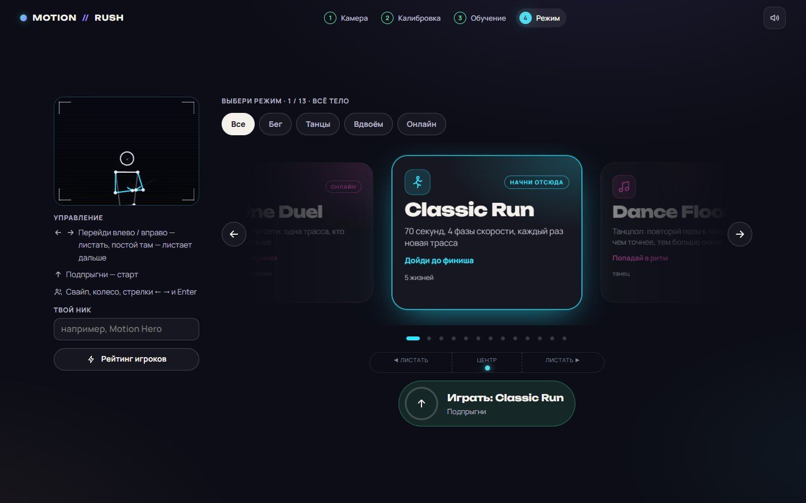 | 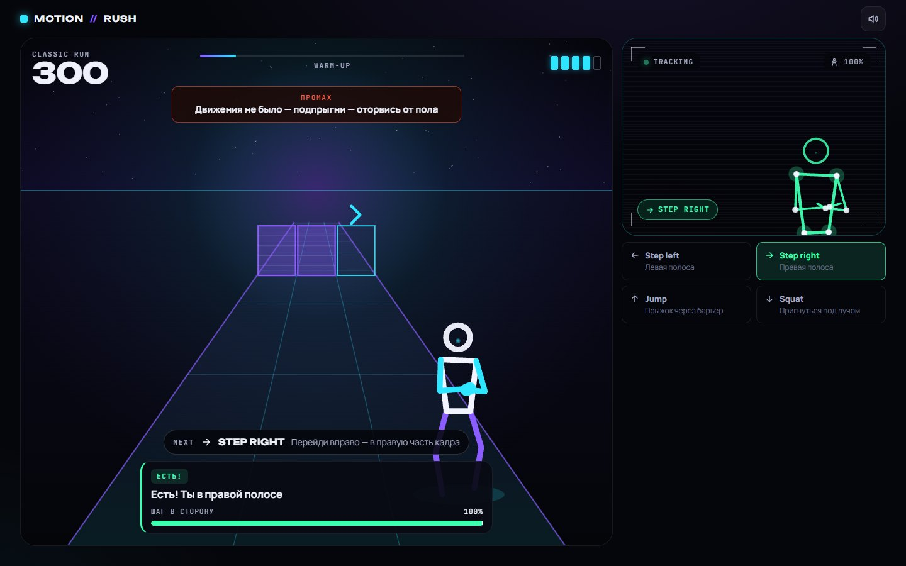 |
| **Режим «ошибка»: двигаются только плечи вместо шага** | **Режим «ошибка»: руки вместо прыжка** |
| 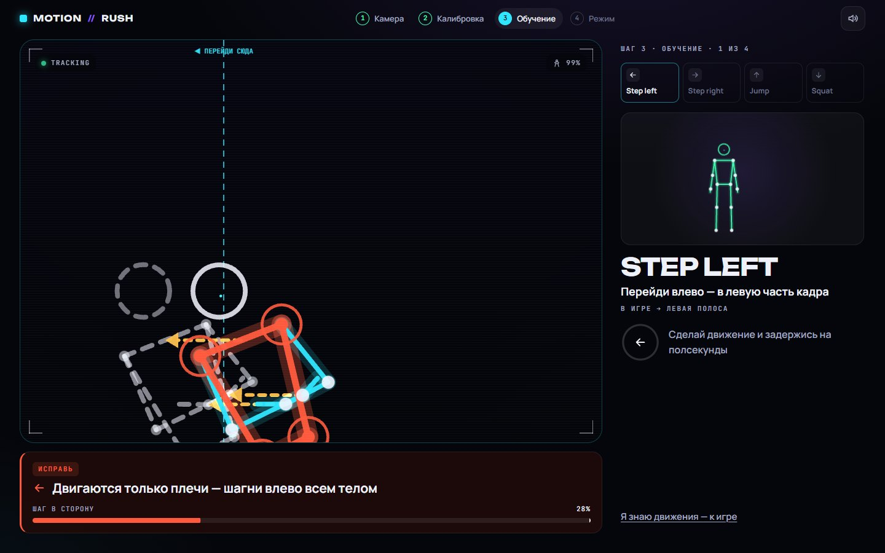 | 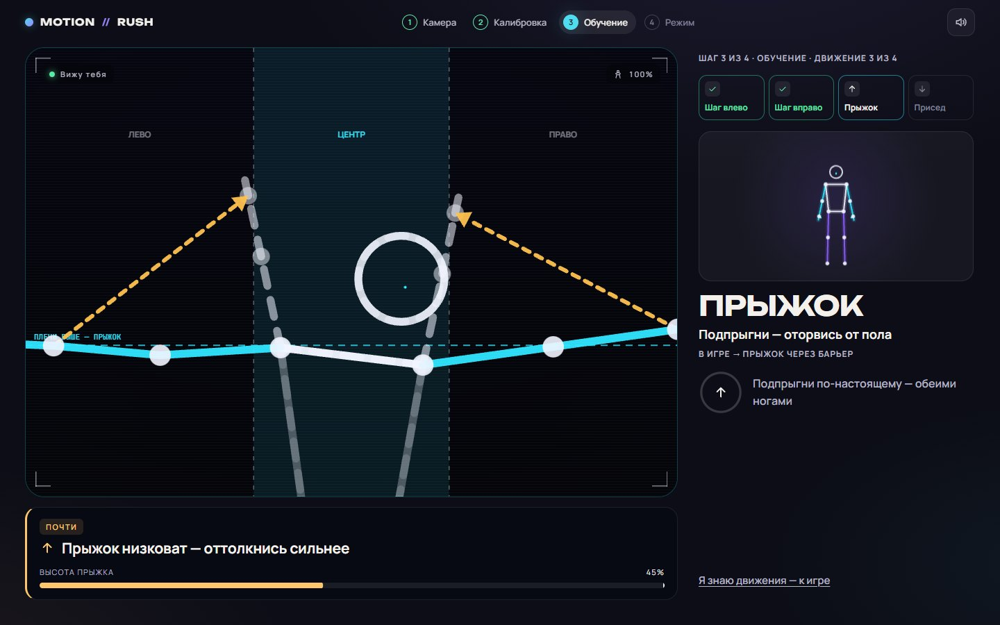 |
| **Dance Floor: всем телом в такт музыке — «призрак» показывает прыжок** | **Dance Battle: двое у одной камеры** |
| 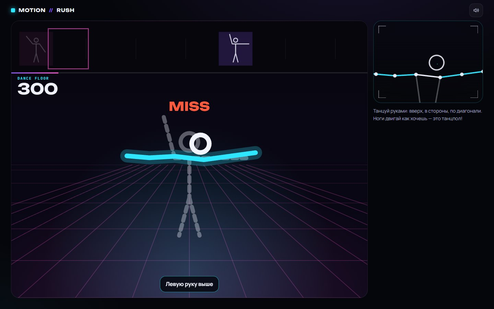 | 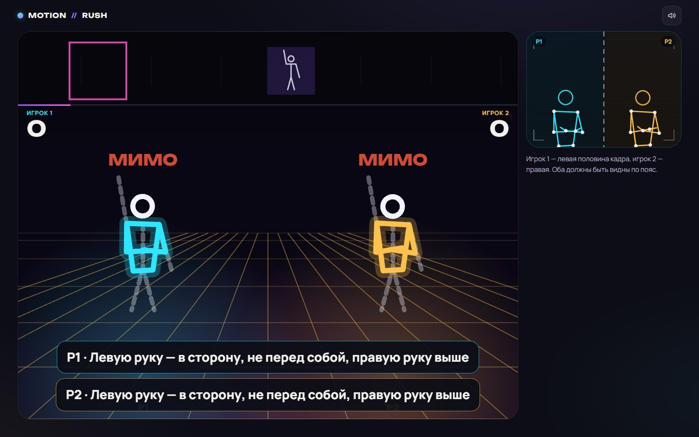 |
| **Игра вдвоём: у каждого своя зона, игра подсказывает, куда сдвинуться** | **Versus 2P: у каждого своя трасса, полосу меняет наклон** |
| 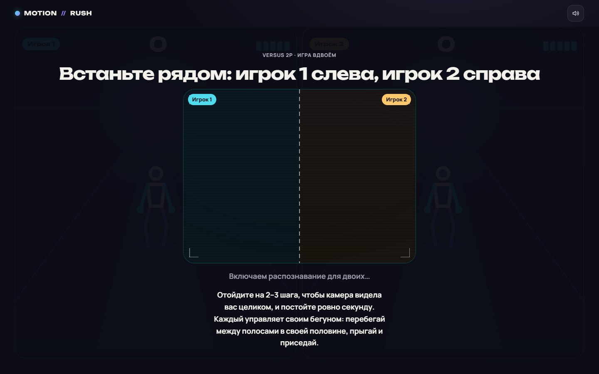 | 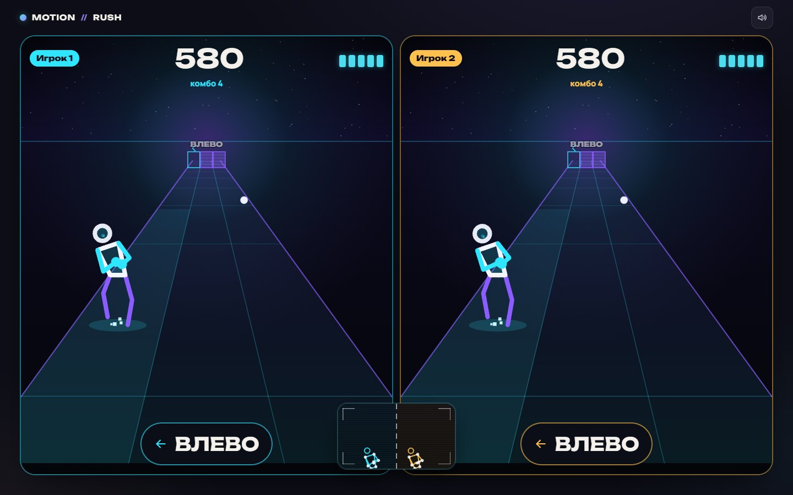 |
| **Star Catch: лови звёзды руками; «Почти!» — подсказка, если рука не дотянулась** | **Freeze!: «Море волнуется» — замри в загаданной фигуре** |
| 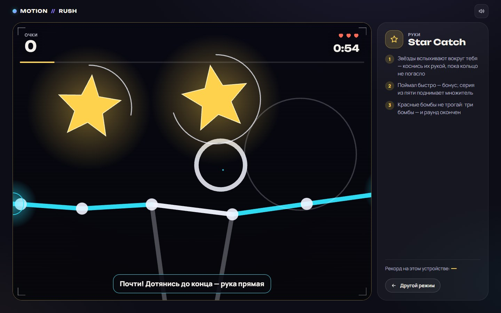 | 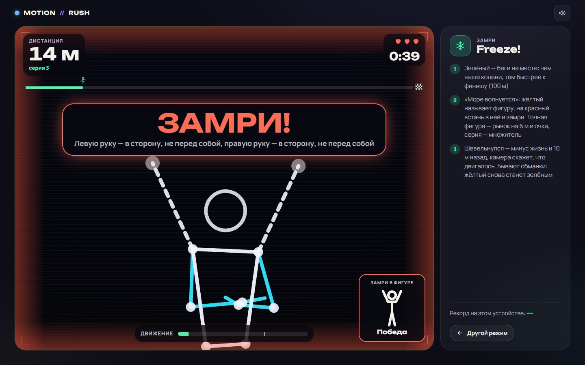 |

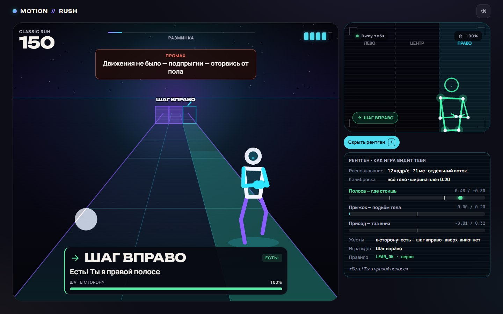

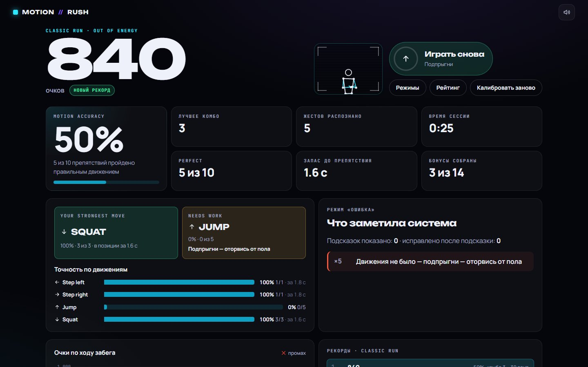
> На скриншотах видеослой камеры скрыт: остались только скелет, «призрак» целевой позы и линии-цели, которые рисует система.

## Что это

Ты встаёшь перед камерой, и твоё тело становится контроллером. **Перейди** в левую или правую часть кадра — бегун уходит в эту полосу, **подпрыгни по-настоящему** — прыгает через барьер, **присядь** — пригибается под лазером. Если ты сидишь за столом, игра сама переключится на «сидячую» схему: наклоны корпуса, руки вверх, пригнуться. Если движение неточное, игра не пишет «не распознано», а говорит **что именно не так и как исправить**: «Двигаются только плечи — шагни влево всем телом», «Руки не считаются — подпрыгни всем телом!», «Не наклоняйся — сгибай колени и опускай таз». Параллельно она показывает целевую позу поверх твоего скелета.

17 режимов: раннеры (Classic, Endless, Blitz, Sprint 30, Daily, Jump & Squat, Lane Rush, Hardcore, Practice), **четыре мини-игры** (Star Catch — лови звёзды руками, Freeze! — «замри» на красный свет, Reaction — реакция в миллисекундах, Squat 30 — приседания на время), **Dance Floor** — танцпол с музыкой, где нужно попадать в бит всем телом: позы рук, приседы, прыжки и шаги, **два режима для двоих у одного ноутбука** (Versus 2P и Dance Battle) и онлайн-дуэль по ссылке. Каждый забег — новая случайная трасса.

**Возможности**

- Распознавание позы в реальном времени прямо в браузере (MediaPipe Pose Landmarker, 33 точки)
- **Настоящие движения всем телом**: полоса определяется тем, **где ты стоишь в кадре** (левая треть — левая полоса), прыжок — по подъёму всего корпуса (руки не считаются), присед — по опусканию таза
- **Честный прыжок**: один прыжок = фиксированное время в воздухе, удержание позы не держит бегуна в воздухе, новый прыжок — только после приземления
- **Две схемы управления, выбор автоматически по калибровке**: «всё тело» (видны бёдра) и «сидя» (только верх тела) — у каждой свои метрики, пороги, подсказки и демо-фигура
- Калибровка под рост и расстояние игрока: все пороги считаются в размерах **его** тела
- Режим «ошибка»: 28 правил диагностики, «призрак» целевой позы, линии-цели, стрелки коррекции, подсветка нужной части тела, шкала прогресса; на танцполе — подсказки для каждой руки
- **Dance Floor**: синтезированный трек 120 BPM, 19 движений — позы рук, приседы, прыжки и шаги в сторону, случайная хореография, PERFECT / GOOD / MISS в такт
- **Два игрока у одного ноутбука**: кадр делится на две половины, у каждого игрока **свой трекер** и свой конвейер распознавания; общий старт 3-2-1, реванш прыжком
- **Подсказки, которые видно с 2–3 м**: следующее движение крупно и совет «режима ошибки» в одной карточке, слово-действие над препятствием («ПРЫЖОК», «ШАГ ВЛЕВО»), подсвеченная полоса на полу (жёлтая → зелёная, когда ты в ней), зоны «ЛЕВО / ЦЕНТР / ПРАВО» на камере
- **Случайные трассы**: новый seed на каждый забег (Daily — одна трасса дня для всех, дуэль — общая для двоих)
- **Бонусы на трассе**: энергосферы и пять суперсил — щит (поглощает промах), буст ×2, магнит, замедление времени, сердце (+1 жизнь)
- **Рейтинг**: локальные рекорды по каждому режиму + мировой лидерборд (всё время / сегодня)
- **Online Duel**: гонка 1 на 1 по сети — быстрая игра со случайным соперником, код комнаты или ссылка-приглашение; соперник виден «призраком» на дорожке
- Выбор режима — карусель с иконками и категориями (Бег, Танцы, Вдвоём, Онлайн): шаг в сторону перед камерой, свайп, перетаскивание мышью, колесо, стрелки
- Законченный сценарий: проверка камеры → калибровка → интерактивное обучение → выбор режима → 3-2-1 → игра → результаты → «играть снова» жестом
- Звук и музыка (синтез WebAudio, без аудиофайлов): трек для забегов 128 BPM, слои которого добавляются вместе со скоростью; настоящая дуга прыжка с приземлением, частицы, фирменный «motion trail»
- Мобильная вёрстка и фронтальная камера телефона; поддержка `prefers-reduced-motion`
- Честная обработка сбоев: запрет доступа, нет камеры, камера занята, не HTTPS, темно, далеко/близко, частично в кадре, потеря трекинга (игра ставится на паузу)
- Оптимизация под слабые ноутбуки: распознавание в Web Worker, адаптивное качество рендера, ровные 60 fps на встроенной графике
- Без регистрации: ник вводится один раз и хранится в браузере
## Соответствие кейсу

| Требование | Как закрыто |
| --- | --- |
| Распознавание в реальном времени в браузере | MediaPipe Tasks Vision (WASM) в Web Worker, 12–30 инференсов/с, рендер 60 fps |
| ≥ 3 разных движения, у каждого своё действие | Перейти влево/вправо → полоса, прыжок → через барьер, присед → под лазером (сидя: наклоны, руки вверх, пригнуться); на танцполе — 19 движений: позы рук, приседы, прыжки, шаги |
| Понятная обратная связь | Стилизованный скелет, подсветка распознанного жеста, бейджи, уверенность трекинга, шкалы, звуки, бегун повторяет позу игрока |
| Законченный сценарий | 17 режимов с финалом, счётом, комбо, энергией, бонусами и экраном результатов |
| Работает в браузере | Чистый фронтенд без установки; онлайн (рейтинг, дуэли) — опционально через Supabase, без него игра полностью работает |
| **Твист: режим «ошибка»** | Отдельный `ErrorDiagnosisEngine`, подробно — [ниже](#error-mode--режим-ошибка) |
| Бонусы | Собственная логика жестов, реальные движения всем телом, танцпол с музыкой, 2 игрока у одной камеры, мировой рейтинг, онлайн-дуэль, адаптация под телефон, звук и эффекты |

## Быстрый старт

Нужен **Node.js 20+** (проверено на Node 24) и npm.

```bash
npm install
npm run dev        # http://localhost:5173
```

Production-сборка:

```bash
npm run build      # проверка типов + сборка в dist/
npm run preview    # http://localhost:4173
```

Прочие команды: `npm test` (юнит-тесты), `npm run lint`, `npm run typecheck`.

### Онлайн: рейтинг и дуэли (необязательно)

Без настройки игра работает офлайн: рекорды хранятся в браузере, карточка Online Duel показывает «Онлайн не настроен». Чтобы включить мировой рейтинг и дуэли:

1. Создай бесплатный проект на [supabase.com](https://supabase.com).
2. **SQL Editor** → вставь и выполни [`supabase/schema.sql`](supabase/schema.sql) (таблица `scores` + политики RLS).
3. **Project Settings → API**: скопируй *Project URL* и *anon public key*.
4. Локально: скопируй `.env.example` в `.env.local` и впиши значения. На Vercel: *Settings → Environment Variables* → `VITE_SUPABASE_URL` и `VITE_SUPABASE_ANON_KEY` → Redeploy.

Дуэлям таблицы не нужны: они идут через Supabase Realtime (broadcast + presence). SDK Supabase грузится отдельным чанком только когда игрок уходит в онлайн.

Перед `dev` и `build` скрипт `scripts/copy-mediapipe-wasm.mjs` копирует WASM-рантайм MediaPipe из `node_modules` в `public/`. Модель позы лежит в репозитории (`public/models`), поэтому приложение не зависит от внешних CDN (CDN используется только как запасной вариант).

### Доступ к камере

1. Нажми **«Начать игру»**, браузер спросит разрешение на камеру. Нажми «Разрешить».
2. Браузеры дают камеру только по **HTTPS** или на **localhost**. С телефона по локальной сети (`http://192.168…`) камера не откроется: открывай задеплоенную версию.
3. Если доступ запрещён, приложение покажет экран «Нет доступа к камере» с кнопками «Попробовать снова» и «Как исправить».
4. Видео не записывается и никуда не отправляется: всё распознавание идёт локально в браузере.

**Как лучше встать:** 2–3 м от камеры, в кадре всё тело и место над головой — тогда игра управляется настоящими прыжками, шагами и приседаниями. Если видно только до пояса (сидишь за ноутбуком), калибровка включит схему «сидя».

## Жесты

Пороги заданы в единицах тела игрока. **SW** — ширина плеч, **ARM** — длина руки; оба значения берутся из калибровки.

Схема управления выбирается **автоматически по калибровке**: если в кадре видны бёдра — «всё тело», иначе — «сидя». Игрок ничего не переключает; тексты, демо-фигура, «призрак», подсказки и пороги подстраиваются сами.

**Всё тело (стоя, 2–3 м от камеры)** — настоящие движения, руками их не обмануть:

| Жест | Что сделать | Метрика | Срабатывает | Отпускается | Действие в игре |
| --- | --- | --- | --- | --- | --- |
| **Step left** | Перейти в левую часть кадра | **где стоит центр таза** в кадре: −1 левый край … 0 центр … +1 правый край | ≤ −0.30 | > −0.20 | левая полоса (ворота слева) |
| **Step right** | Перейти в правую часть кадра | то же | ≥ 0.30 | < 0.20 | правая полоса |
| **Jump** | Подпрыгнуть | подъём **и таза, и плеч** (берётся меньший) | ≥ 0.20 SW | < 0.10 SW | прыжок через барьер |
| **Squat** | Присесть | опускание **таза** от нейтрали | ≥ 0.32 SW | < 0.18 SW | пригнуться под лазером |
| *Center* | Встать по центру кадра | \|позиция таза\| | < 0.20 | — | центральные ворота |

Полоса — это **место в кадре**, а не наклон: стоишь в левой трети картинки — бежишь по левой полосе, в правой — по правой. Нужная зона подсвечивается с надписью «ИДИ СЮДА», и к ней ведёт стрелка от игрока (раньше там был полупрозрачный скелет-цель, но в стороне от человека он выглядел так, будто скелет «съехал»). Наклон одних плеч полосу не меняет — на это есть подсказка режима «ошибка».

Прыжок — «быстрый» жест: в воздухе человек ~300–400 мс, поэтому он подтверждается на первом чётком кадре (остальные жесты — после ≥ 2 кадров и 70 мс). В игре один прыжок = **700 мс в воздухе**; удерживать позу бессмысленно, а следующий прыжок возможен только после приземления — поэтому прыгать нужно вовремя, как в настоящем раннере. Поднятые руки без подъёма тела прыжком не считаются, поклон без опускания таза — приседом: на каждый такой случай есть своё правило режима «ошибка».

**Сидя (за столом, видно до пояса)**:

| Жест | Что сделать | Метрика | Срабатывает | Отпускается | Действие в игре |
| --- | --- | --- | --- | --- | --- |
| **Lean left** | Наклон корпуса влево | смещение центра плеч от нейтрали | ≥ 0.38 SW | < 0.22 SW | левая полоса |
| **Lean right** | Наклон корпуса вправо | то же, вправо | ≥ 0.38 SW | < 0.22 SW | правая полоса |
| **Arms up** | Обе руки над головой | высота **нижней** кисти над своим плечом | ≥ 0.42 ARM | < 0.22 ARM | прыжок через барьер |
| **Crouch** | Пригнуться | опускание центра плеч от нейтрали | ≥ 0.30 SW | < 0.17 SW | пригнуться под лазером |
| *Center* | Сесть ровно | \|смещение плеч\| | < 0.20 SW | — | центральные ворота |

Жесты работают на двух независимых каналах. **Боковой** (шаги/наклоны) и **вертикальный** (прыжок/присед) можно совмещать: стоять в левой полосе и прыгать. Внутри канала конфликт решается фиксированным приоритетом (прыжок > присед), поэтому поведение детерминировано.

## Режимы игры

Режим выбирается в карусели: перейди влево/вправо перед камерой (сидя — наклонись), свайпни или перетащи карточку, прыжок (сидя — руки вверх) запускает.

| Режим | Правила | Трасса | В рейтинге |
| --- | --- | --- | --- |
| **Classic Run** | 5 жизней, 4 фазы скорости | ~70 с, каждый раз новая | да |
| **Dance Floor** | танцпол: повторяй движения с карточек в такт музыке — руки, приседы, прыжки, шаги; PERFECT / GOOD / MISS, комбо ×4 | трек 64 с, случайная хореография | да |
| **Dance Battle** | 2 игрока у одной камеры танцуют одну хореографию | трек 64 с | нет |
| **Versus 2P** | 2 игрока у одной камеры, у каждого своя трасса на разделённом экране | одна случайная трасса на двоих | нет |
| **Endless** | 3 жизни, скорость растёт бесконечно (7 фаз: Разминка → … → Безумие) | до 10 минут | да |
| **Blitz** | 3 жизни, максимальная скорость с первой секунды | 45 с | да |
| **Sprint 30** | 5 жизней, плотная трасса без разгона | 30 с | да |
| **Daily Challenge** | 5 жизней | новая каждый день (seed из даты по Астане), одна для всех | да (+ таблица «сегодня») |
| **Jump & Squat** | только барьеры и лучи — тренировка ног | 60 с | да |
| **Lane Rush** | только ворота — постоянно перебегай между полосами | 60 с | да |
| **Hardcore** | **1 жизнь** — одна ошибка и конец | классическая | да |
| **Practice** | промахи не отнимают энергию, большие интервалы | медленная, 60 с | нет |
| **Online Duel** | 1 на 1 по сети, одна трасса на двоих | seed выбирает хост комнаты | нет |
| **Star Catch** | мини-игра: звёзды вспыхивают вокруг игрока — лови руками, бомбы не трогай, 3 жизни | 60 с | на устройстве |
| **Freeze!** | мини-игра «Море волнуется»: зелёный — беги на месте, жёлтый называет фигуру, красный — замри в ней; точная фигура — рывок и очки, пойман — минус жизнь и 10 м | до 100 м | на устройстве |
| **Reaction** | мини-игра: 10 сигналов, сделай показанное движение быстрее — время в мс | 10 раундов | на устройстве |
| **Squat 30** | мини-игра: сколько полных приседаний за 30 секунд | 30 с | на устройстве |

**Бонусы на трассе** (лови, стоя в нужной полосе): энергосфера +30 очков и пять суперсил — примерно каждый третий бонус:

- **SHIELD** — щит поглощает следующий промах (энергия не тратится);
- **BOOST** — очки ×2 на 8 секунд;
- **MAGNET** — 8 секунд энергосферы со всех полос летят к бегуну;
- **SLOWMO** — замедление: игровое время идёт на 60% скорости около 8 секунд, препятствия подлетают медленнее, окна по времени шире;
- **HEART** — +1 жизнь (при полной энергии — +100 очков).

Щит виден «пузырём» вокруг бегуна, магнит — розовыми дугами поля, замедление — фиолетовой рамкой экрана, буст — жёлтым цветом бегуна; у каждой силы есть значок в HUD.

**Рейтинг.** Локальная таблица топ-8 для каждого режима (в браузере) и мировой лидерборд (Supabase): вкладки по режимам, «всё время» / «сегодня». Ник вводится один раз; результат отправляется автоматически после забега.

**Online Duel.** Два способа найти соперника: **«Быстрая игра»** — ждёшь в общей очереди, и два игрока, ждущих дольше всех, автоматически попадают в одну комнату; или **комната для друга** — отправь ссылку-приглашение (`?room=КОД`) или назови 4-буквенный код. По ссылке второй игрок после настройки камеры сразу попадает в комнату. Оба подтверждают готовность (прыжком), хост комнаты выбирает seed — оба бегут **одну и ту же трассу**. Во время гонки ~5 раз в секунду передаются счёт, полоса, прыжок/присед и прогресс: соперник виден розовым «призраком» на соседней дорожке и в панели «ты впереди на N». На экране результатов — «Победа / Поражение / Ничья» и «Реванш» на новой трассе. Видео никуда не передаётся — только эти несколько чисел.

### Мини-игры

Четыре коротких режима со своими механиками поверх того же распознавания (`features/arcade/`, один общий экран `ArcadeScreen`, рисование — `ArcadeRenderer`). Логика каждой игры — чистый класс с тестами.

- **Star Catch** — звёзды вспыхивают вокруг игрока, всегда в пределах вытянутой руки (1–2 ширины плеч от центра плеч, не там, где сейчас руки). Касание считается по пути кисти между кадрами, поэтому быстрый взмах тоже ловит. Быстрая ловля — бонус, серия из пяти — множитель, красные бомбы отнимают жизнь. Если рука прошла совсем рядом, а звезда погасла, — подсказка «Почти! Дотянись до конца — рука прямая».
- **Freeze!** — «Море волнуется, раз…». Камера считает «энергию движения» — среднюю скорость суставов в ширинах плеч в секунду, отдельно для рук, ног и корпуса.
  - На зелёный бег на месте двигает к финишу (100 м).
  - Жёлтый свет называет **морскую фигуру** — позу рук с танцпола: «Самолёт», «Победа», «Статуя Свободы», «Пингвин», «Регулировщик», «Диско». Первый красный — просто «замри».
  - На красный есть секунда, чтобы встать в фигуру, потом движение дольше 0,28 с ловит игрока. Пока фигура принимается, подсказка режима «ошибка» говорит, какую руку поправить, а пунктирные руки от плеч показывают цель (зелёные — рука на месте).
  - Если средняя точность за красный ≥ 68%, это **статуя**: рывок на 6 м и 250 очков, серия статуй — до ×3.
  - Иногда жёлтый — **обманка** и снова становится зелёным.
  - Пойман — минус жизнь и 10 м, игра говорит, что именно шевельнулось («двигались руки»), и подсвечивает эти суставы. Музыка на красный стихает.
- **Reaction** — встань ровно, дождись сигнала и сделай показанное движение. Время считается от сигнала до кадра камеры, в котором движение распознано, поэтому задержка нейросети не идёт в зачёт. Движение до сигнала — фальстарт, не то движение — штраф. В итоге — средняя и лучшая реакция по каждому движению.
- **Squat 30** — полные приседания за 30 секунд: присед засчитывается, когда игрок опустился достаточно глубоко и встал. Движок диагностики ждёт присед, поэтому неглубокий присед или наклон получает обычную подсказку режима «ошибка».

Рекорды мини-игр хранятся на устройстве: таблица мирового рейтинга принимает только режимы из `supabase/schema.sql` (чтобы добавить мини-игры, расширьте `scores_mode_check` и включите `ranked`).

### Dance Floor — танцпол

Играет синтезированный трек (120 BPM: бочка, хлопки, хэты, бас, арпеджио — всё генерирует WebAudio). По таймлайну едут карточки с движениями; когда карточка въезжает в розовую рамку, нужно быть в этом движении. Танцуют **всем телом**: в библиотеке 19 движений.

- **11 поз рук.** Поза — это направление каждой руки от плеча (0° — вниз, 90° — в сторону, 180° — вверх): «Руки вверх», «Самолёт», «Диско ↖», «Левая вверх, правая в сторону» и т. д.
- **8 движений всем телом**, где тело и руки вместе: «Присед, руки в стороны», «Пружинка», «Прыжок, руки вверх», «Звезда», «Шаг влево, левая вверх», «Шаг вправо, диско» и другие. Присед, прыжок и шаг измеряются по плечам относительно места, где танцор стоит (в ширинах плеч: присед ≥ 0,35, прыжок ≥ 0,2, шаг ≥ 0,5). Поэтому они работают, даже если в кадре человек по пояс, и для двоих тоже. Место танцора плавно следует за ним между движениями, но не «уплывает» во время приседа. Такое движение — наполовину руки, наполовину тело: одними руками его не станцевать.
- Хореография каждый раз случайная: начало спокойное, только руками, затем каждое второе движение — всем телом. Нет двух одинаковых движений подряд, шаги чередуют стороны, как в step-touch.

- Оценка — лучшее совпадение в окне −250…+300 мс вокруг доли: **PERFECT** (≥ 82%), **GOOD** (≥ 55%), иначе **MISS**. Комбо даёт множитель до ×4.
- Время песни берётся из часов `AudioContext`, поэтому оценка совпадает с тем, что игрок слышит.
- Режим «ошибка» на танцполе: целевое движение рисуется пунктирным «призраком» поверх танцора. Он приседает, подпрыгивает или шагает туда, куда нужно, а сам танцор на экране двигается вместе с телом. Подсказка сначала говорит о теле, потом о руках: «Присядь глубже», «Шагни ещё левее», «Подпрыгни на бит и руки как на карточке», «Левую руку выше, правую руку ниже», «Правую руку — в сторону, не перед собой».
- В результатах: точность, perfect / good / miss, лучшая и самая слабая поза.

### Двое у одного ноутбука

**Versus 2P** и **Dance Battle** рассчитаны на двух игроков перед одной камерой: левая половина кадра — игрок 1, правая — игрок 2.

**Широкий кадр.** Камеры ноутбуков почти всегда широкие (16:9), а одиночная игра просит у них 640×480 — и браузер обрезает по краям четверть ширины. В режимах для двоих игра просит у той же камеры кадр 16:9 (`CameraSource.setWide`, без повторного запроса доступа), а после — возвращает прежний режим, так что калибровка одиночной игры остаётся верной. На всякий случай движок сам сдвигает её, если камера вернулась не в тот режим, а трекеры сбрасываются при смене размера кадра. Окна камеры на экранах подстраиваются под форму кадра (`--video-aspect`). Если камера умеет только 4:3, всё работает как раньше, просто места меньше.

**Как распознаются двое.** MediaPipe с `numPoses: 2` иногда находит одного и того же человека дважды — и, «найдя двоих», перестаёт искать дальше, поэтому второго игрока игра не видела. Теперь в режимах для двоих каждый кадр в воркере режется на две чуть перекрывающиеся половины, и на каждой работает **свой трекер одного человека** — та же схема, что надёжно работает в одиночной игре (`splitTracking.ts`, второй landmarker создаётся при первом входе в режим). Результат приходит с номером игрока; человека, которого увидели обе половины, засчитывают один раз — на той стороне, где он стоит. Если второй трекер создать не удалось, есть запасной путь с одним трекером, и он никогда не отдаёт одного человека обоим игрокам.

**Чтобы скелет не «съезжал» с человека.** MediaPipe ищет человека в кадре один раз, а дальше следит за областью, где видел его в прошлый раз. Поэтому: (1) при переходе между целым кадром и половиной трекер сбрасывается — старая область указывала бы не туда; (2) трекер, который «прилип» к соседу или к человеку, которого видят обе половины, раз в 1,5 с ищет заново; (3) пороги уверенности строже стандартных (0,6), так что слабый след после резкого движения отбрасывается, и человек находится заново; (4) скелеты двоих рисуются с тем же плавным сглаживанием, что и в одиночной игре.

- В **Versus 2P** у каждого игрока свой конвейер (`PlayerTracker`: сглаживание → быстрая калибровка → признаки → классификатор → машины состояний → режим «ошибка»), свои полосы и своя трасса на разделённом экране. Полосы отсчитываются **от места, где игрок встал на калибровке**, и следят за плечами: полосу меняет **наклон корпуса или маленький шаг** (~15 см). Ходить к соседу или к краю кадра не нужно — на двоих у ноутбука просто нет места для больших шагов. Перед стартом у каждого подсвечена своя зона «ВСТАНЬ СЮДА»: место в своей половине, где хватает простора для наклона в обе стороны. Если игрок стоит у края кадра или у середины, он видит «Сдвинься левее/правее» и стрелку, а если вдвоём не помещаетесь — «Отойди на шаг назад». Трасса одна и та же, старт 3-2-1 общий, во время гонки внизу — мини-камера с обоими скелетами в цветах игроков. Два трекера дают примерно 5 кадров в секунду на игрока (в одиночной игре — 10–30), поэтому движение засчитывается на 0,3–0,5 с позже, а короткий прыжок попадает максимум в один кадр. Для двоих это учтено: трасса спокойнее (`COURSES.duo`: препятствия раз в 2,1–3 с), окна шире (полёт 900 мс вместо 700, опоздание до 450 мс вместо 200), сглаживание легче и прыжок чуть чувствительнее (порог ≈0,15 ширины плеч вместо 0,2). Победа по очкам, реванш — прыжок любого из двоих.
- В **Dance Battle** оба танцуют одну хореографию под общую музыку, каждый получает свою оценку и подсказки. Перед музыкой у каждого тоже подсвечена зона «ВСТАНЬ СЮДА» — шире отступ от края и от середины, чтобы хватило места развести руки в стороны (`standZone.ts`, общий с Versus). Музыка начинается, только когда оба стоят в своих зонах.
- Камера не засыпает: браузер ставит на паузу `<video>`, убранный со страницы, поэтому на экранах без окна камеры видео «паркуется» в невидимый контейнер, а движок сам возобновляет остановленную камеру.
## Сценарий

```
LANDING → CAMERA PERMISSION → CAMERA CHECK → CALIBRATION → TUTORIAL → MODES → COUNTDOWN → GAME → RESULTS → PLAY AGAIN
                                                                           └→ LOBBY (Online Duel) → GAME → RESULTS → REMATCH
```

- **Camera check** — чек-лист: камера, модель, тело в кадре, расстояние, свет, один игрок. Переход происходит сам, когда трекинг стабилен 1.3 с (не по одному случайному кадру).
- **Calibration** — 2.2 с неподвижно с опущенными руками. Любое движение или поднятая рука перезапускают захват.
- **Tutorial** — интерактивный. Каждое движение нужно реально выполнить (шаг/присед удержать 0.45 с, прыжок — один настоящий прыжок), и уже здесь работает режим «ошибка».
- **Modes** — выбор режима телом, ник, переход в рейтинг. После первого обучения повторная калибровка ведёт сразу сюда.
- **Game** — например, Classic: ~70 с, 4 фазы скорости (Разминка → Разгон → Скорость → Финиш), около 30 препятствий, 5 жизней, комбо и множитель ×1–×4 (×8 с бустом), фоновая музыка.
- **Results** — всё посчитано из записанного забега, таблица рекордов режима, отправка в мировой рейтинг, итог дуэли. «Играть снова» — подпрыгни (сидя: подними обе руки и держи) или кликни.

Мышь и клавиатура нужны только для стандартных действий браузера: разрешить камеру и нажать первую кнопку. Игра проходится телом.

## Motion Recognition

```
camera ─▶ pose landmarks ─▶ normalization ─▶ smoothing ─▶ body features ─▶ custom gesture rules ─▶ state machine ─▶ GestureEvent
 (getUserMedia)  (MediaPipe)    (mirror, units)   (One-Euro)   (relative to calibration)   (thresholds)      (stable, hysteresis, cooldown)
```

Библиотека отвечает **только** за «кадр → 33 точки». Всё остальное написано командой:

1. **LandmarkNormalizer** зеркалит координаты (экран работает как зеркало, левая рука слева) и переводит их в единицы высоты кадра по обеим осям, чтобы расстояния не искажались соотношением сторон.
2. **Один игрок**: MediaPipe отслеживает одного человека от кадра к кадру, поэтому управление не перескакивает на прохожего. Режим `numPoses: 2` в конфиге включает предупреждение «ONE PLAYER ONLY»: игрок выбирается по близости к прошлому кадру, дубли одного тела отбрасываются. Но это медленнее.
3. **MotionSmoother** — фильтр One-Euro на каждой координате: сильное сглаживание в покое, минимальная задержка при быстром движении. Видимость сглаживается EMA. При кратковременной потере точек поза удерживается 320 мс.
4. **Качество кадра**: нет тела / частично в кадре / далеко / близко / не по центру / мало места над головой / темно (яркость кадра раз в секунду).
5. **FeatureExtractor** считает признаки относительно калибровки: сдвиг плеч, таза и головы, опускание плеч, носа и таза, подъём всего тела (минимум из подъёма таза и плеч — так прыжок не спутать с поднятыми руками или наклоном), высоту каждой кисти и локтя над своим плечом, углы локтей, масштаб тела. Пиксели нигде не используются как порог.
6. **GestureClassifier** — по одной объяснимой метрике на жест для каждой схемы управления, пороги берутся из `GESTURE_CONFIG`. Уверенность = видимость нужных точек (для схемы «всё тело» — и таза, и плеч) × запас над порогом.
7. **GestureStateMachine** (по одной на канал): `NEUTRAL → CANDIDATE → CONFIRMED → COOLDOWN`. Кандидат подтверждается после ≥ 2 кадров и ≥ 70 мс при уверенности ≥ 0.5 (настоящий прыжок — сразу, на первом чётком кадре). Отпускание идёт по нижнему порогу (гистерезис). Cooldown 200 мс не даёт тому же жесту повториться (никаких LEFT LEFT LEFT). Жест с большим приоритетом может перехватить подтверждённый.
8. **GestureEvent** `{ type, phase: start|end, confidence, timestamp, features, source }` уходит в игру, обучение и звук.

Если кисти вышли за верх кадра, «руки вверх» засчитываются по высоко поднятым локтям.

Калибровка реально влияет на распознавание: она задаёт нейтральную позицию (плеч **и таза**), единицы SW/ARM и схему управления (всё тело или сидя). Пока игрок стоит нейтрально, нейтраль медленно подстраивается под небольшой дрейф, а настоящие попытки жеста не поглощаются.

## Error Mode — режим «ошибка»

Цель — чтобы игрок **понял, почему движение не сработало, и сразу исправил его**. Вместо «жест не распознан» он получает конкретную инструкцию: какую часть тела, в какую сторону и насколько сдвинуть.

### Как определяется неправильное движение

Экран (обучение или игра) сообщает движку, **чего он ждёт** (`expected`: ближайшее препятствие или текущий шаг обучения). `ErrorDiagnosisEngine` каждый кадр прогоняет таблицу правил вида **условие → диагноз → инструкция → приоритет** и выбирает самое приоритетное сработавшее правило. У каждого правила есть вердикт:

| Вердикт | Смысл |
| --- | --- |
| `correct` | движение выполнено |
| `near` | правильное движение, но недостаточно (например, руки на 70% нужной высоты) |
| `wrong` | движение выполнено неправильно (одна рука, не та сторона, только голова) |
| `other` | делается **другой** жест (присел вместо прыжка) |
| `idle` | попытки ещё нет: показываем подсказку-цель, а не ошибку |

### Правила (28 шт., 21 из них — конкретные ошибки)

Правило может относиться к одной схеме управления (`schemes`): у «всего тела» и «сидя» свои типичные ошибки.

| Ожидаем | Правило | Условие (по реальным точкам) | Подсказка |
| --- | --- | --- | --- |
| Jump (тело) | `JUMP_ARMS_ONLY` | руки подняты ≥ 0.20 ARM, тело не поднялось | «Руки не считаются — подпрыгни всем телом!» |
| Jump (тело) | `JUMP_TOO_LOW` | тело поднялось на 0.07–0.20 SW | «Прыжок низковат — оттолкнись сильнее» |
| Step (тело) | `LEAN_SHOULDERS_ONLY` | плечи сдвинулись ≥ 0.30 SW, таз на месте | «Двигаются только плечи — шагни влево всем телом» |
| Squat (тело) | `CROUCH_BOW` | плечи опустились ≥ 0.28 SW, таз почти нет | «Не наклоняйся — сгибай колени и опускай таз» |
| Arms up | `JUMP_ONE_HAND` | одна кисть ≥ 0.42 ARM, вторая < −0.15 ARM | «Подними и **правую** руку — нужны обе руки над головой» |
| Arms up | `JUMP_ONE_HAND_LOW` | одна рука у цели, вторая на полпути | «Правая рука ниже цели — подними её выше головы» |
| Arms up | `JUMP_ELBOWS_BENT` | руки подняты, угол локтя < 130° | «Руки согнуты в локтях — выпрями их вверх над головой» |
| Arms up | `JUMP_HANDS_LOW` | обе кисти между −0.15 и 0.42 ARM | «Руки на уровне плеч — подними их выше головы» |
| Arms up | `JUMP_HANDS_OUT_OF_FRAME` | кисти не видны, локти выше плеч | «Кисти выходят за верх кадра — отойди на шаг назад» |
| Arms up | `JUMP_DOING_CROUCH` | активен присед, руки внизу | «Это присед. Для прыжка выпрямись и подними обе руки вверх» |
| Lean | `LEAN_INSUFFICIENT` | сдвиг плеч 0.12–0.38 SW в нужную сторону | «Наклон недостаточный — сместись ещё **левее**» |
| Lean | `LEAN_WRONG_DIRECTION` | сдвиг ≥ 0.18 SW в другую сторону | «Не в ту сторону — наклонись ВЛЕВО» |
| Lean | `LEAN_HEAD_ONLY` | голова сдвинулась ≥ 0.28 SW, плечи < 0.14 SW | «Наклоняется только голова — сдвинь плечи влево вместе с корпусом» |
| Lean | `LEAN_TURNED` | ширина плеч < 72% калибровочной | «Ты развернулся боком — встань лицом к камере и наклонись влево» |
| Lean | `LEAN_DOING_JUMP` / `LEAN_DOING_CROUCH` | делается прыжок/присед вместо наклона | «Руки тут не помогут — наклони корпус влево» |
| Crouch | `CROUCH_INSUFFICIENT` | плечи опустились на 0.12–0.40 SW | «Присядь глубже — ещё немного вниз» |
| Crouch | `CROUCH_HEAD_ONLY` | нос ниже на ≥ 0.30 SW, плечи на месте | «Опускается только голова — присядь всем корпусом» |
| Crouch | `CROUCH_OFF_CENTER` | в приседе корпус ушёл вбок ≥ 0.34 SW | «Сделай присед ниже, сохраняя корпус по центру» |
| Crouch | `CROUCH_DOING_JUMP` | руки подняты вместо приседа | «Руки вниз — под лучом нужно присесть, а не прыгать» |
| Center | `CENTER_OFF` | \|сдвиг\| ≥ 0.20 SW | «Верни корпус в центр — сместись правее» |

Сторона («левую/правую», «левее/правее») и часть тела вычисляются из точек, а не берутся из заготовки. Полная таблица — в [`src/features/gestures/diagnosisRules.ts`](src/features/gestures/diagnosisRules.ts).

### Как это выглядит

- **Панель подсказки**: вердикт (ПОЧТИ / ИСПРАВЬ / НЕ ТО ДВИЖЕНИЕ / ЕСТЬ!), стрелка направления, инструкция и живая шкала метрики («ВЫСОТА РУК 72%» до отметки цели). Цвет — не единственный канал: всегда есть текст и стрелка.
- **Текущее vs целевое**: поверх камеры рисуется пунктирный «призрак». Это твоя же поза, минимально изменённая так, чтобы жест засчитался (руки подняты, корпус повёрнут вокруг таза, плечи опущены). Стрелки ведут от текущих кистей и плеч к целевым.
- **Линии-цели** из тех же порогов: «ПЛЕЧИ ВЫШЕ — ПРЫЖОК», «◀ ШАГНИ СЮДА», «ТАЗ НИЖЕ» (сидя: «РУКИ ВЫШЕ», «◀ ПЛЕЧИ СЮДА», «ПЛЕЧИ НИЖЕ»). «Призрак» для схемы «всё тело» сдвигает/поднимает/опускает всё тело целиком.
- **Подсветка части тела**: проблемные суставы пульсируют тёплым цветом (руки при прыжке, плечи и корпус при наклоне, таз и колени при приседе).
- **Без мигания**: новая подсказка должна продержаться 220 мс, показанная висит минимум 900 мс, успех показывается сразу.
- **В игре** при промахе всплывает причина («Промах: Руки на уровне плеч — подними их выше головы»). Отдельно ловятся игровые ошибки: `TOO_EARLY` («Прыжок был слишком рано…») и `NO_ATTEMPT`.
- **В результатах** есть блок «Что заметила система»: частые ошибки со счётчиком, сколько подсказок показано и сколько ошибок исправлено после подсказки.

### Почему это не «gesture not recognized»

Каждый диагноз — функция от измеренных признаков тела относительно **твоей** калибровки. Система знает, какого движения ждёт, насколько ты к нему близок (прогресс 0–100%), какая часть тела мешает и куда её двигать. Юнит-тесты проверяют, что ни одна подсказка не бывает общей фразой.

## Architecture

```
src/
├─ app/                 App (сценарий), flow reducer
├─ config/              GESTURE_CONFIG, TRACKING_CONFIG, GAME_CONFIG — все пороги и тюнинг
├─ features/
│  ├─ camera/           CameraSource (getUserMedia, ошибки), LightMeter
│  ├─ tracking/         воркер MediaPipe (pose.worker, landmarkerCore), LandmarkNormalizer, MotionSmoother,
│  │                    splitTracking (двое у одной камеры), frameQuality, poseSelection, landmarks, syntheticPose
│  ├─ gestures/         FeatureExtractor, calibration, GestureClassifier, GestureStateMachine,
│  │                    diagnosisRules, ErrorDiagnosisEngine (+HintScheduler), targetPose
│  ├─ engine/           MotionEngine — realtime-цикл, Store для React
│  ├─ gameplay/         course (seeded, пресеты трасс), GameEngine (детерминированная логика, бонусы, правила режима)
│  ├─ dance/            позы, хореография, DanceEngine (оценка в такт), синтезированная музыка
│  ├─ versus/           PlayerTracker — отдельный конвейер распознавания на игрока, зоны «встань сюда»
│  ├─ arcade/           мини-игры: StarCatch, FreezeGame, ReactionGame, SquatGame (чистая логика + тесты)
│  ├─ modes/            GAME_MODES — 17 режимов: трасса, жизни, seed, ранжирование, окна по времени
│  ├─ online/           globalLeaderboard (Supabase), DuelRoom (Realtime presence + broadcast)
│  ├─ render/           CameraOverlayRenderer, GameRenderer (+ «призрак» соперника), DanceRenderer, skeletonRenderer, particles,
│  │                    sprites (SVG-ассеты сцены, растеризуются один раз)
│  └─ results/          sessionStats
├─ components/          CameraViewport, HintPanel, DemoFigure, HoldGesture, NicknameField, Ring, DebugPanel…
├─ screens/             Landing, Permission, CameraError, CameraCheck, Calibration, Tutorial,
│                       ModeSelect, DuelLobby, Leaderboard, game/, dance/, versus/, results/
supabase/schema.sql     таблица мирового рейтинга + RLS
├─ hooks/  lib/  styles/
```

```
               ┌──────────── requestAnimationFrame (60 fps) ────────────┐
CameraSource → PoseTracker (12–30 Hz, адаптивно) → Normalizer → Smoother → Features
            → Classifier → StateMachine ×2 → ErrorDiagnosis ─┬─▶ frame listeners: GameEngine, canvas-рендеры
                                                             └─▶ Store (редкие изменения) ─▶ React UI
```

### Производительность (ноутбуки со встроенной графикой)

- **MediaPipe работает в Web Worker** (`pose.worker.ts`). Основной поток только передаёт кадр камеры (`VideoFrame` без копирования, иначе `ImageBitmap`) и получает точки упакованными в `Float32Array`. В полёте не больше одного кадра, поэтому частота распознавания сама подстраивается под устройство. Если воркеры недоступны, инференс идёт на основном потоке.
- **Делегат CPU в воркере.** На встроенной Intel-графике GPU-делегат при первом запуске ~10 с компилирует шейдеры и на это время подвешивает отрисовку всей страницы. CPU (XNNPACK) даёт ровные 60 fps с первой секунды. `numPoses: 1`: MediaPipe следит за одним игроком, почти не запуская детектор, это на ~35% быстрее.
- **Адаптивное качество** (`QualityGovernor`). При устойчиво долгих кадрах снижается DPR canvas (1.5 → 1.25 → 1), отключаются glow-проходы, уменьшаются частицы и шлейфы. Уровень поднимается обратно не сразу, чтобы не раскачиваться туда-сюда.
- **Плавность при 12–30 Гц распознавания.** Отрисовываемая поза каждый кадр мягко догоняет последнюю распознанную (`displayPose`), а распознавание работает с точными данными.
- **Без дорогих эффектов:** нет `backdrop-filter` и CSS-фильтров поверх постоянно меняющихся canvas. Статичный фон сцены нарисован на отдельном слое один раз, в кадре нет лишних аллокаций.
- **React не перерисовывается на каждом кадре камеры.** Покадровые данные живут в мутируемом `MotionFrame`, canvas и игра подписаны на цикл движка напрямую, шкалы пишутся в DOM через refs. В React попадают только редкие изменения. Все ресурсы (камера, воркер, rAF, таймеры, wake lock) освобождаются.

Замер в Chrome на ноутбуке с Intel UHD Graphics, 15 с игры:

| | FPS | p95 кадра | блокировки основного потока |
| --- | --- | --- | --- |
| до оптимизации | 24 | 84 мс | 12.1 с из 15 |
| после | **60** | **17 мс** | **0** |

## Библиотеки

| Библиотека | Зачем |
| --- | --- |
| [@mediapipe/tasks-vision](https://ai.google.dev/edge/mediapipe/solutions/vision/pose_landmarker) | Pose Landmarker (lite): кадр → 33 точки. Только это |
| React 19 + Vite + TypeScript (strict) | UI и сборка |
| [Motion](https://motion.dev) (`motion/react`) | переходы экранов, отсчёт 3-2-1, пружины комбо, прокрутка счёта |
| [@supabase/supabase-js](https://supabase.com/docs/reference/javascript) | мировой рейтинг (Postgres + RLS) и дуэли (Realtime); грузится лениво, только при онлайне |
| Canvas 2D (свой код) | скелет, «призрак», игровая сцена, частицы, motion trail |
| Vitest, ESLint, typescript-eslint | тесты и качество кода |

Kokonut UI, Bklit UI и Anime.js рассматривались и **сознательно не подключены**. Первые две требуют Tailwind + shadcn, то есть вторую систему стилей ради пары карточек и одного графика. Anime.js дублировал бы Motion. Графики результатов — небольшие собственные SVG-компоненты. Вся графика игры (горизонт, препятствия, бонусы, обложки режимов) — собственные SVG-ассеты в `src/assets/`, без стоков и внешних картинок. Шрифты: Unbounded, Manrope, JetBrains Mono (Google Fonts, OFL).

## Тесты и качество

```bash
npm test          # 193 теста: геометрия, нормализация, сглаживание, калибровка, классификатор
                  # (обе схемы), машина состояний, правила ошибок, планировщик подсказок, «призрак»,
                  # генерация трассы, игровая логика, режимы и бонусы, daily seed, сценарий приложения,
                  # честный прыжок, танцпол (углы рук, присед / прыжок / шаг всем телом, оценка, подсказки, хореография),
                  # онлайн-комната дуэли и быстрая игра (на фейковом Realtime), упаковка точек воркер→поток,
                  # раскладка двух игроков по половинам кадра, зоны «встань сюда», регулятор качества рендера,
                  # мини-игры (звёзды, «замри», реакция, приседания)
npm run lint
npm run typecheck
```

Для тестов распознавания используются синтетические фикстуры поз (`src/test/fixtures.ts`): сидя — `validLeftLean`, `validJump`, `oneHandJump`, `bentArmsJump`, `headOnlyLeft`…; всё тело — `validStepLeft`, `shouldersOnlyLeft`, `validRealJump`, `lowJump`, `armsOnlyJump`, `validSquat`, `bowInsteadOfSquat` и др. Тесты проверяют ожидаемый жест, ожидаемое правило ошибки и переходы состояний. Отдельный тест убеждается, что целевая поза-«призрак» действительно распознаётся как нужный жест.

## Debug-режим

Добавь `?debug=1` к адресу, и появится панель со следующими данными:
- FPS, частота и время инференса, делегат (GPU/CPU), где идёт распознавание (worker/main);
- уровень качества рендера, p95 длительности кадра, число long tasks за 10 с;
- уверенность трекинга, состояние каналов, сработавшее правило ошибки, сырые признаки, пороги и калибровка.

Жюри эта панель по умолчанию не видна.

Параметры для диагностики конкретного устройства: `?worker=0` (распознавание на основном потоке), `?delegate=gpu` или `?delegate=cpu`, `?frame=bitmap`.

## Деплой

Сборка — обычная статика из `dist/` (`base: './'`, работает и в подпапке).

- **Vercel / Netlify**: импортировать репозиторий → build command `npm run build`, output `dist`. Для онлайна добавь переменные окружения `VITE_SUPABASE_URL` и `VITE_SUPABASE_ANON_KEY` (см. [выше](#онлайн-рейтинг-и-дуэли-необязательно)) и сделай Redeploy — они встраиваются при сборке.
- **GitHub Pages**: `npm run build` и опубликовать `dist/` (например, через GitHub Actions `actions/deploy-pages`).

Хостинг обязательно должен быть по HTTPS, иначе браузер не даст камеру. Статика весит ~30 МБ, в основном WASM MediaPipe и модель; всё отдаётся с того же домена.

## Ограничения

- Нужна фронтальная камера и достаточно света. В темноте MediaPipe теряет точки, и приложение об этом предупреждает.
- Одновременно играет один человек. Трекер держится за одного игрока и не перескакивает на других; предупреждение «в кадре несколько людей» по умолчанию выключено ради скорости (`numPoses: 2` включает его).
- Для схемы «всё тело» нужно отойти на 2–3 м, чтобы в кадр попали бёдра. Если камера видит только верх тела, игра честно переходит на «сидячую» схему (руки вверх вместо прыжка).
- Если сидеть вплотную к ноутбуку, поднятые руки не помещаются в кадр. Приложение просит отойти и страхуется распознаванием по локтям.
- На слабых телефонах и в браузерах без аппаратного WebGL инференс медленнее: частота распознавания снижается автоматически (минимум 12 Гц), и реакция чуть запаздывает.
- Без Supabase рейтинг только локальный, а дуэль недоступна. Мировой рейтинг принимает результаты с клиента (публичный ключ + RLS только на чтение/добавление): для хакатона этого достаточно, но защиты от подделки счёта нет.
- Режимы для двоих требуют, чтобы оба игрока были видны целиком (по пояс для танцпола) — нужно отойти подальше; с камерой 4:3 танцорам нужно стоять дальше (около 3 м), чем с широкой. Распознавание двух людей чуть медленнее, чем одного.
- Полоса в схеме «всё тело» — это место в кадре: при узком угле обзора камеры нужно делать шаг побольше.
- Дуэль — best-effort по сети: состояние соперника приходит ~5 раз в секунду и плавно интерполируется; на плохом соединении «призрак» может отставать.

## Development History

- Проект создан с нуля во время хакатона, первый коммит — 28.09.2026. **Заготовок, сделанных до старта, нет.**
- Код написан с помощью AI-ассистента Claude Code (см. `Co-Authored-By` в коммитах).
- Сторонние материалы: модель `pose_landmarker_lite.task` и WASM-рантайм MediaPipe (Apache 2.0), шрифты Google Fonts (OFL). Остальная логика — распознавание жестов, калибровка, сглаживание, машина состояний, диагностика ошибок, игра, UI — написана в рамках хакатона.
