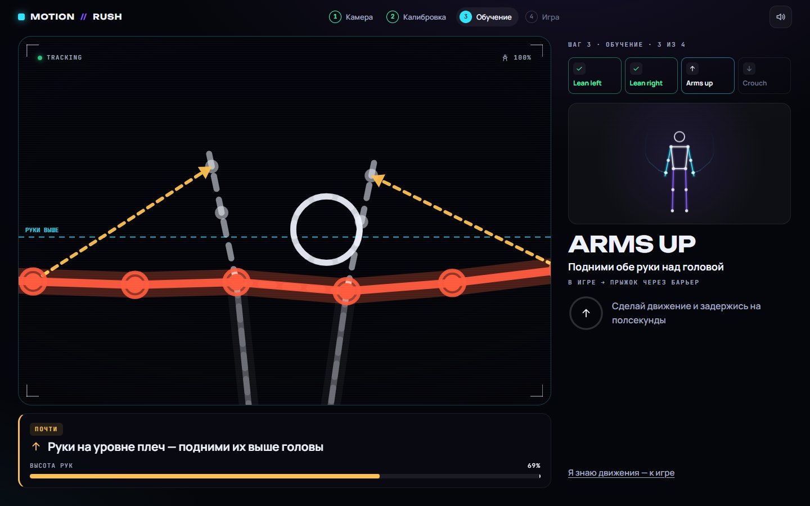
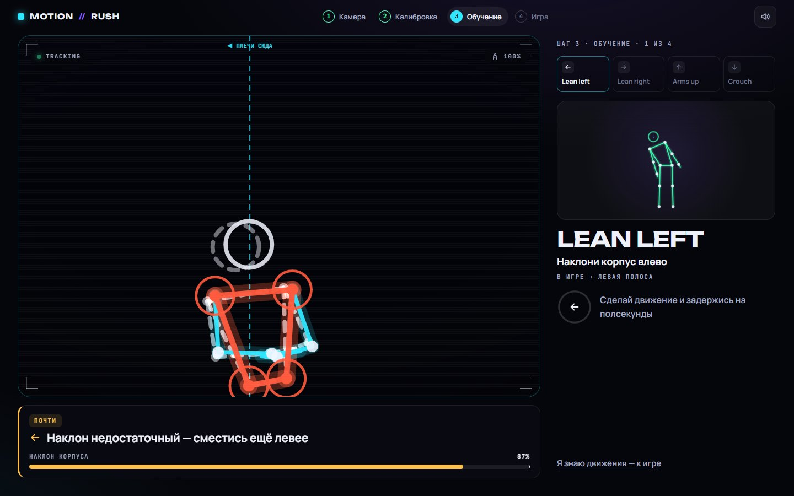

# MOTION//RUSH

**Браузерная неоновая игра-раннер, которой управляют телом через обычную веб-камеру. Move. Don't click.**

Admit Hackathon 2026 · кейс «Motion — камера вместо джойстика» · направление **A / GAME**

🔗 **Демо:** _ссылка появится после деплоя_ · работает в Chrome / Edge / Safari / Firefox, на ноутбуке и телефоне, ничего устанавливать не нужно.


| Режим «ошибка»: руки недостаточно высоко | Игра: камера управляет бегуном |
| --- | --- |
|  |  |
| **Наклон на 87% от нужного: линия-цель и подсветка корпуса** | **Результаты, посчитанные из реального забега** |
|  |  |

> На скриншотах видеослой камеры скрыт: остались только скелет, «призрак» целевой позы и линии-цели, которые рисует система.

## Что это

Ты встаёшь перед камерой, и твоё тело становится контроллером. Наклонись — бегун уходит в полосу, подними руки — прыгает через барьер, присядь — пригибается под лазером. Если движение неточное, игра не пишет «не распознано», а говорит **что именно не так и как исправить**: «Правая рука ниже цели — подними её выше головы», «Наклон недостаточный — сместись ещё левее», «Опускается только голова — присядь всем корпусом». Параллельно она показывает целевую позу поверх твоего скелета.

**Возможности**

- Распознавание позы в реальном времени прямо в браузере (MediaPipe Pose Landmarker, 33 точки)
- 4 жеста с собственной логикой распознавания и отдельными действиями (+ «вернись в центр» для центральных ворот)
- Калибровка под рост и расстояние игрока: все пороги считаются в размерах **его** тела
- Режим «ошибка»: 25 правил диагностики, «призрак» целевой позы, линии-цели, стрелки коррекции, подсветка нужной части тела, шкала прогресса
- Законченный сценарий: проверка камеры → калибровка → интерактивное обучение → 3-2-1 → ~70 с игры → результаты → «играть снова» жестом
- Результаты, посчитанные из реального забега: точность, сильное и слабое движение, частые ошибки, график, локальная таблица рекордов
- Звук (синтез WebAudio), визуальные эффекты, фирменный «motion trail»
- Мобильная вёрстка и фронтальная камера телефона; поддержка `prefers-reduced-motion`
- Честная обработка сбоев: запрет доступа, нет камеры, камера занята, не HTTPS, темно, далеко/близко, частично в кадре, несколько людей, потеря трекинга (игра ставится на паузу)

## Соответствие кейсу

| Требование | Как закрыто |
| --- | --- |
| Распознавание в реальном времени в браузере | MediaPipe Tasks Vision (WASM + WebGL/CPU), 12–30 инференсов/с, рендер 60 fps |
| ≥ 3 разных движения, у каждого своё действие | Наклон влево → левая полоса, наклон вправо → правая, руки вверх → прыжок, присед → пригнуться |
| Понятная обратная связь | Стилизованный скелет, подсветка распознанного жеста, бейджи, уверенность трекинга, шкалы, звуки, бегун повторяет позу игрока |
| Законченный сценарий | 70-секундный забег с финалом, счётом, комбо, энергией и экраном результатов |
| Работает в браузере | Чистый фронтенд, без бэкенда и установки |
| **Твист: режим «ошибка»** | Отдельный `ErrorDiagnosisEngine`, подробно — [ниже](#error-mode--режим-ошибка) |
| Бонусы | Собственная логика жестов, локальные рекорды, адаптация под телефон, звук и эффекты |

## Быстрый старт

Нужен **Node.js 20+** (проверено на Node 24) и npm.

```bash
npm install
npm run dev        # http://localhost:5173
```

Production-сборка:

```bash
npm run build      # проверка типов + сборка в dist/
npm run preview    # http://localhost:4173
```

Прочие команды: `npm test` (юнит-тесты), `npm run lint`, `npm run typecheck`.

Перед `dev` и `build` скрипт `scripts/copy-mediapipe-wasm.mjs` копирует WASM-рантайм MediaPipe из `node_modules` в `public/`. Модель позы лежит в репозитории (`public/models`), поэтому приложение не зависит от внешних CDN (CDN используется только как запасной вариант).

### Доступ к камере

1. Нажми **START MOTION**, браузер спросит разрешение на камеру. Нажми «Разрешить».
2. Браузеры дают камеру только по **HTTPS** или на **localhost**. С телефона по локальной сети (`http://192.168…`) камера не откроется: открывай задеплоенную версию.
3. Если доступ запрещён, приложение покажет экран «Нет доступа к камере» с кнопками «Попробовать снова» и «Как исправить».
4. Видео не записывается и никуда не отправляется: всё распознавание идёт локально в браузере.

**Как лучше встать:** 1.5–2.5 м от камеры, видно тело хотя бы до пояса, над головой есть место для поднятых рук. Можно играть и сидя: калибровка определит режим «верхняя часть тела».

## Жесты

Пороги заданы в единицах тела игрока. **SW** — ширина плеч, **ARM** — длина руки; оба значения берутся из калибровки.

| Жест | Что сделать | Метрика | Срабатывает | Отпускается | Действие в игре |
| --- | --- | --- | --- | --- | --- |
| **Lean left** | Наклон/шаг влево | смещение центра плеч от нейтрали | ≥ 0.38 SW | < 0.22 SW | левая полоса (ворота слева) |
| **Lean right** | Наклон/шаг вправо | то же, вправо | ≥ 0.38 SW | < 0.22 SW | правая полоса |
| **Arms up** | Обе руки над головой | высота **нижней** кисти над своим плечом | ≥ 0.42 ARM | < 0.22 ARM | прыжок через барьер |
| **Crouch** | Присесть / пригнуться | опускание центра плеч от нейтрали | ≥ 0.40 SW (сидя 0.30) | < 0.22 SW | пригнуться под лазером |
| *Center* | Встать ровно | \|смещение\| | < 0.20 SW | — | центральные ворота |

Жесты работают на двух независимых каналах. **Боковой** (наклоны) и **вертикальный** (прыжок/присед) можно совмещать: стоять в левой полосе и прыгать. Внутри канала конфликт решается фиксированным приоритетом (руки вверх > присед), поэтому поведение детерминировано.

## Сценарий

```
LANDING → CAMERA PERMISSION → CAMERA CHECK → CALIBRATION → TUTORIAL → COUNTDOWN → GAME → RESULTS → PLAY AGAIN
```

- **Camera check** — чек-лист: камера, модель, тело в кадре, расстояние, свет, один игрок. Переход происходит сам, когда трекинг стабилен 1.3 с (не по одному случайному кадру).
- **Calibration** — 2.2 с неподвижно с опущенными руками. Любое движение или поднятая рука перезапускают захват.
- **Tutorial** — интерактивный. Каждое движение нужно реально выполнить и удержать 0.45 с, и уже здесь работает режим «ошибка».
- **Game** — ~70 с, 4 фазы сложности (Warm-up → Flow → Rush → Challenge), около 30 препятствий, 5 ячеек энергии, комбо и множитель ×1–×4.
- **Results** — всё посчитано из записанного забега. «Играть снова» — подними обе руки и держи (или кликни).

Мышь и клавиатура нужны только для стандартных действий браузера: разрешить камеру и нажать первую кнопку. Игра проходится телом.

## Motion Recognition

```
camera ─▶ pose landmarks ─▶ normalization ─▶ smoothing ─▶ body features ─▶ custom gesture rules ─▶ state machine ─▶ GestureEvent
 (getUserMedia)  (MediaPipe)    (mirror, units)   (One-Euro)   (relative to calibration)   (thresholds)      (stable, hysteresis, cooldown)
```

Библиотека отвечает **только** за «кадр → 33 точки». Всё остальное написано командой:

1. **LandmarkNormalizer** зеркалит координаты (экран работает как зеркало, левая рука слева) и переводит их в единицы высоты кадра по обеим осям, чтобы расстояния не искажались соотношением сторон.
2. **Выбор игрока**: при нескольких людях берётся поза, ближайшая к игроку на прошлом кадре, поэтому управление не перескакивает на прохожего. Дубли одного тела отбрасываются.
3. **MotionSmoother** — фильтр One-Euro на каждой координате: сильное сглаживание в покое, минимальная задержка при быстром движении. Видимость сглаживается EMA. При кратковременной потере точек поза удерживается 320 мс.
4. **Качество кадра**: нет тела / частично в кадре / далеко / близко / не по центру / мало места над головой / темно (яркость кадра раз в секунду).
5. **FeatureExtractor** считает признаки относительно калибровки: сдвиг плеч и головы, опускание плеч, носа и бёдер, высоту каждой кисти и локтя над своим плечом, углы локтей, масштаб тела. Пиксели нигде не используются как порог.
6. **GestureClassifier** — по одной объяснимой метрике на жест, пороги берутся из `GESTURE_CONFIG`. Уверенность = видимость нужных точек × запас над порогом.
7. **GestureStateMachine** (по одной на канал): `NEUTRAL → CANDIDATE → CONFIRMED → COOLDOWN`. Кандидат подтверждается после ≥ 2 кадров и ≥ 70 мс при уверенности ≥ 0.5. Отпускание идёт по нижнему порогу (гистерезис). Cooldown 200 мс не даёт тому же жесту повториться (никаких LEFT LEFT LEFT). Жест с большим приоритетом может перехватить подтверждённый.
8. **GestureEvent** `{ type, phase: start|end, confidence, timestamp, features, source }` уходит в игру, обучение и звук.

Если кисти вышли за верх кадра, «руки вверх» засчитываются по высоко поднятым локтям.

Калибровка реально влияет на распознавание: она задаёт нейтральную позицию, единицы SW/ARM и режим (всё тело или сидя, где порог приседа мягче). Пока игрок стоит нейтрально, нейтраль медленно подстраивается под небольшой дрейф, а настоящие попытки жеста не поглощаются.

## Error Mode — режим «ошибка»

Цель — чтобы игрок **понял, почему движение не сработало, и сразу исправил его**. Вместо «жест не распознан» он получает конкретную инструкцию: какую часть тела, в какую сторону и насколько сдвинуть.

### Как определяется неправильное движение

Экран (обучение или игра) сообщает движку, **чего он ждёт** (`expected`: ближайшее препятствие или текущий шаг обучения). `ErrorDiagnosisEngine` каждый кадр прогоняет таблицу правил вида **условие → диагноз → инструкция → приоритет** и выбирает самое приоритетное сработавшее правило. У каждого правила есть вердикт:

| Вердикт | Смысл |
| --- | --- |
| `correct` | движение выполнено |
| `near` | правильное движение, но недостаточно (например, руки на 70% нужной высоты) |
| `wrong` | движение выполнено неправильно (одна рука, не та сторона, только голова) |
| `other` | делается **другой** жест (присел вместо прыжка) |
| `idle` | попытки ещё нет: показываем подсказку-цель, а не ошибку |

### Правила (25 шт., 18 из них — конкретные ошибки)

| Ожидаем | Правило | Условие (по реальным точкам) | Подсказка |
| --- | --- | --- | --- |
| Arms up | `JUMP_ONE_HAND` | одна кисть ≥ 0.42 ARM, вторая < −0.15 ARM | «Подними и **правую** руку — нужны обе руки над головой» |
| Arms up | `JUMP_ONE_HAND_LOW` | одна рука у цели, вторая на полпути | «Правая рука ниже цели — подними её выше головы» |
| Arms up | `JUMP_ELBOWS_BENT` | руки подняты, угол локтя < 130° | «Руки согнуты в локтях — выпрями их вверх над головой» |
| Arms up | `JUMP_HANDS_LOW` | обе кисти между −0.15 и 0.42 ARM | «Руки на уровне плеч — подними их выше головы» |
| Arms up | `JUMP_HANDS_OUT_OF_FRAME` | кисти не видны, локти выше плеч | «Кисти выходят за верх кадра — отойди на шаг назад» |
| Arms up | `JUMP_DOING_CROUCH` | активен присед, руки внизу | «Это присед. Для прыжка выпрямись и подними обе руки вверх» |
| Lean | `LEAN_INSUFFICIENT` | сдвиг плеч 0.12–0.38 SW в нужную сторону | «Наклон недостаточный — сместись ещё **левее**» |
| Lean | `LEAN_WRONG_DIRECTION` | сдвиг ≥ 0.18 SW в другую сторону | «Не в ту сторону — наклонись ВЛЕВО» |
| Lean | `LEAN_HEAD_ONLY` | голова сдвинулась ≥ 0.28 SW, плечи < 0.14 SW | «Наклоняется только голова — сдвинь плечи влево вместе с корпусом» |
| Lean | `LEAN_TURNED` | ширина плеч < 72% калибровочной | «Ты развернулся боком — встань лицом к камере и наклонись влево» |
| Lean | `LEAN_DOING_JUMP` / `LEAN_DOING_CROUCH` | делается прыжок/присед вместо наклона | «Руки тут не помогут — наклони корпус влево» |
| Crouch | `CROUCH_INSUFFICIENT` | плечи опустились на 0.12–0.40 SW | «Присядь глубже — ещё немного вниз» |
| Crouch | `CROUCH_HEAD_ONLY` | нос ниже на ≥ 0.30 SW, плечи на месте | «Опускается только голова — присядь всем корпусом» |
| Crouch | `CROUCH_OFF_CENTER` | в приседе корпус ушёл вбок ≥ 0.34 SW | «Сделай присед ниже, сохраняя корпус по центру» |
| Crouch | `CROUCH_BEND_KNEES` | (видны бёдра) плечи опустились, а таз почти нет | «Сгибай колени — опускай таз, а не только плечи» |
| Crouch | `CROUCH_DOING_JUMP` | руки подняты вместо приседа | «Руки вниз — под лучом нужно присесть, а не прыгать» |
| Center | `CENTER_OFF` | \|сдвиг\| ≥ 0.20 SW | «Верни корпус в центр — сместись правее» |

Сторона («левую/правую», «левее/правее») и часть тела вычисляются из точек, а не берутся из заготовки. Полная таблица — в [`src/features/gestures/diagnosisRules.ts`](src/features/gestures/diagnosisRules.ts).

### Как это выглядит

- **Панель подсказки**: вердикт (ПОЧТИ / ИСПРАВЬ / НЕ ТО ДВИЖЕНИЕ / ЕСТЬ!), стрелка направления, инструкция и живая шкала метрики («ВЫСОТА РУК 72%» до отметки цели). Цвет — не единственный канал: всегда есть текст и стрелка.
- **Текущее vs целевое**: поверх камеры рисуется пунктирный «призрак». Это твоя же поза, минимально изменённая так, чтобы жест засчитался (руки подняты, корпус повёрнут вокруг таза, плечи опущены). Стрелки ведут от текущих кистей и плеч к целевым.
- **Линии-цели** из тех же порогов: «РУКИ ВЫШЕ», «◀ ПЛЕЧИ СЮДА», «ПЛЕЧИ НИЖЕ».
- **Подсветка части тела**: проблемные суставы пульсируют тёплым цветом (руки при прыжке, плечи и корпус при наклоне, таз и колени при приседе).
- **Без мигания**: новая подсказка должна продержаться 220 мс, показанная висит минимум 900 мс, успех показывается сразу.
- **В игре** при промахе всплывает причина («Промах: Руки на уровне плеч — подними их выше головы»). Отдельно ловятся игровые ошибки: `TOO_EARLY` («Прыжок был слишком рано…») и `NO_ATTEMPT`.
- **В результатах** есть блок «Что заметила система»: частые ошибки со счётчиком, сколько подсказок показано и сколько ошибок исправлено после подсказки.

### Почему это не «gesture not recognized»

Каждый диагноз — функция от измеренных признаков тела относительно **твоей** калибровки. Система знает, какого движения ждёт, насколько ты к нему близок (прогресс 0–100%), какая часть тела мешает и куда её двигать. Юнит-тесты проверяют, что ни одна подсказка не бывает общей фразой.

## Architecture

```
src/
├─ app/                 App (сценарий), flow reducer
├─ config/              GESTURE_CONFIG, TRACKING_CONFIG, GAME_CONFIG — все пороги и тюнинг
├─ features/
│  ├─ camera/           CameraSource (getUserMedia, ошибки), LightMeter
│  ├─ tracking/         PoseTracker (MediaPipe), LandmarkNormalizer, MotionSmoother,
│  │                    frameQuality, poseSelection, landmarks, syntheticPose (фикстуры/демо)
│  ├─ gestures/         FeatureExtractor, calibration, GestureClassifier, GestureStateMachine,
│  │                    diagnosisRules, ErrorDiagnosisEngine (+HintScheduler), targetPose
│  ├─ engine/           MotionEngine — realtime-цикл, Store для React
│  ├─ gameplay/         course (seeded), GameEngine (детерминированная логика)
│  ├─ render/           CameraOverlayRenderer, GameRenderer, skeletonRenderer, particles
│  └─ results/          sessionStats
├─ components/          CameraViewport, HintPanel, DemoFigure, HoldGesture, Ring, DebugPanel…
├─ screens/             Landing, Permission, CameraError, CameraCheck, Calibration, Tutorial,
│                       game/, results/
├─ hooks/  lib/  styles/
```

```
               ┌──────────── requestAnimationFrame (60 fps) ────────────┐
CameraSource → PoseTracker (12–30 Hz, адаптивно) → Normalizer → Smoother → Features
            → Classifier → StateMachine ×2 → ErrorDiagnosis ─┬─▶ frame listeners: GameEngine, canvas-рендеры
                                                             └─▶ Store (редкие изменения) ─▶ React UI
```

**Производительность.** React не перерисовывается на каждом кадре камеры. Покадровые данные живут в мутируемом `MotionFrame`, canvas-рендеры и игра подписаны на цикл движка напрямую, шкалы и проценты пишутся в DOM через refs. В React попадают только редкие изменения (статус трекинга, распознанный жест, смена подсказки, счёт). Частота инференса подстраивается под устройство. Если GPU-делегат работает медленно (Chrome иногда эмулирует WebGL программно), MediaPipe автоматически переключается на CPU. Все ресурсы (поток камеры, rAF, таймеры, слушатели, wake lock) освобождаются при уходе со страницы или со сцены.

## Библиотеки

| Библиотека | Зачем |
| --- | --- |
| [@mediapipe/tasks-vision](https://ai.google.dev/edge/mediapipe/solutions/vision/pose_landmarker) | Pose Landmarker (lite): кадр → 33 точки. Только это |
| React 19 + Vite + TypeScript (strict) | UI и сборка |
| [Motion](https://motion.dev) (`motion/react`) | переходы экранов, отсчёт 3-2-1, пружины комбо, прокрутка счёта |
| Canvas 2D (свой код) | скелет, «призрак», игровая сцена, частицы, motion trail |
| Vitest, ESLint, typescript-eslint | тесты и качество кода |

Kokonut UI, Bklit UI и Anime.js рассматривались и **сознательно не подключены**. Первые две требуют Tailwind + shadcn, то есть вторую систему стилей ради пары карточек и одного графика. Anime.js дублировал бы Motion. Графики результатов — небольшие собственные SVG-компоненты. Шрифты: Unbounded, Manrope, JetBrains Mono (Google Fonts, OFL).

## Тесты и качество

```bash
npm test          # 91 тест: геометрия, нормализация, сглаживание, калибровка, классификатор,
                  # машина состояний, правила ошибок, планировщик подсказок, «призрак»,
                  # генерация трассы, игровая логика, статистика, сценарий приложения
npm run lint
npm run typecheck
```

Для тестов распознавания используются синтетические фикстуры поз (`src/test/fixtures.ts`): `validLeftLean`, `invalidLeftLean`, `validJump`, `almostJump`, `oneHandJump`, `bentArmsJump`, `validCrouch`, `almostCrouch`, `headOnlyLeft`, `bowInsteadOfSquat` и др. Тесты проверяют ожидаемый жест, ожидаемое правило ошибки и переходы состояний. Отдельный тест убеждается, что целевая поза-«призрак» действительно распознаётся как нужный жест.

## Debug-режим

Добавь `?debug=1` к адресу: появится панель с FPS, частотой и временем инференса, делегатом (GPU/CPU), уверенностью трекинга, состоянием каналов, сработавшим правилом ошибки, сырыми признаками, порогами и калибровкой. Жюри эта панель по умолчанию не видна.

## Деплой

Сборка — обычная статика из `dist/` (`base: './'`, работает и в подпапке).

- **Vercel / Netlify**: импортировать репозиторий → build command `npm run build`, output `dist`.
- **GitHub Pages**: `npm run build` и опубликовать `dist/` (например, через GitHub Actions `actions/deploy-pages`).

Хостинг обязательно должен быть по HTTPS, иначе браузер не даст камеру. Статика весит ~30 МБ, в основном WASM MediaPipe и модель; всё отдаётся с того же домена.

## Ограничения

- Нужна фронтальная камера и достаточно света. В темноте MediaPipe теряет точки, и приложение об этом предупреждает.
- Одновременно играет один человек. Второго система замечает и просит выйти из кадра, но управление за ним не переключает.
- «Прыжок» — это жест «руки вверх», а не физический прыжок: так надёжнее при любой высоте камеры.
- Если сидеть вплотную к ноутбуку, поднятые руки не помещаются в кадр. Приложение просит отойти и страхуется распознаванием по локтям.
- На слабых телефонах и в браузерах без аппаратного WebGL инференс медленнее: частота распознавания снижается автоматически (минимум 12 Гц), и реакция чуть запаздывает.
- Таблица рекордов локальная (`localStorage` этого браузера), онлайн-лидерборда нет.

## Development History

- Проект создан с нуля во время хакатона, первый коммит — 28.09.2026. **Заготовок, сделанных до старта, нет.**
- Код написан с помощью AI-ассистента Claude Code (см. `Co-Authored-By` в коммитах).
- Сторонние материалы: модель `pose_landmarker_lite.task` и WASM-рантайм MediaPipe (Apache 2.0), шрифты Google Fonts (OFL). Остальная логика — распознавание жестов, калибровка, сглаживание, машина состояний, диагностика ошибок, игра, UI — написана в рамках хакатона.
